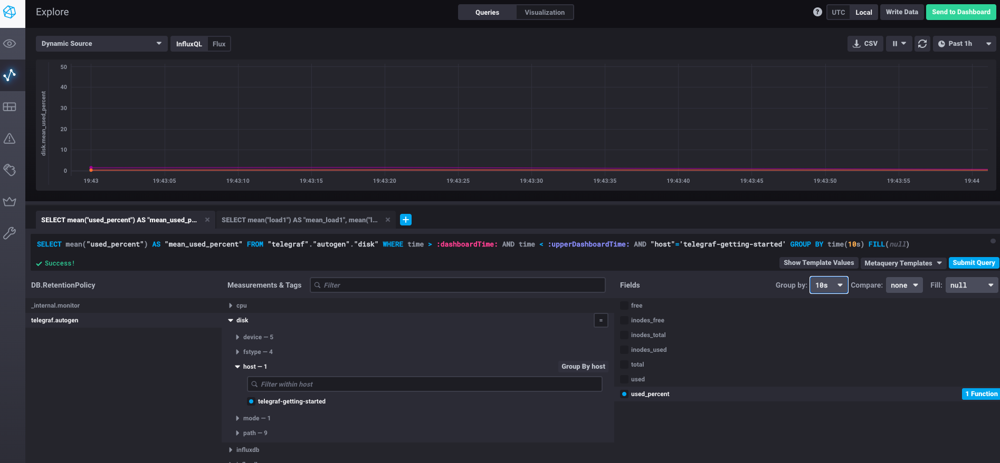

# Домашнее задание к занятию "10.02. Системы мониторинга"

## Обязательные задания

1. Опишите основные плюсы и минусы pull и push систем мониторинга.

### Ответ
#### Push
| Плюсы | Минусы |
|:----|:----|
Можно слать данные в несколько точек сбора (серверов мониторинга) | Могут прилетать данные не с наших агентов (плохо настроили, подмена агента).
Достаточно настроить только агента | Страдает оперативность - поздно узнаём об инцеденте и поздно реагируем
Накопление данных и отправка их в заданные промежутки времени | Потеря пакетов приводит к потере или искажению метрик 
Протокол UDP - быстрее передаём и меньше грузим канал | 

#### Pull
| Плюсы | Минусы |
|:----|:----|
Выше безопасность. Какие агенты прописаны, от тех и принимаем данные | Больше работы по настройке системы мониторинга. Неприменимо в динамично меняющейся среде.
Можно повысить безопасность с помощью шифрования соединения (SSL, TLS) | Накладные расходы на шифрование
Получение данных вне системы мониторига для своих целей - дашборды, статистика, состояния в своих веб-приложениях, либо отладка, контроль, резервирование системы мониторинга. |


2. Какие из ниже перечисленных систем относятся к push модели, а какие к pull? А может есть гибридные?

    - Prometheus - pull
    - TICK - push
    - Zabbix - гибридная (и push и pull)
    - VictoriaMetrics - гибридная
    - Nagios - pull


3. Склонируйте себе [репозиторий](https://github.com/influxdata/sandbox/tree/master) и запустите TICK-стэк, 
используя технологии docker и docker-compose.

В виде решения на это упражнение приведите выводы команд с вашего компьютера (виртуальной машины):

    - curl http://localhost:8086/ping
    - curl http://localhost:8888
    - curl http://localhost:9092/kapacitor/v1/ping

А также скриншот веб-интерфейса ПО chronograf (`http://localhost:8888`). 

P.S.: если при запуске некоторые контейнеры будут падать с ошибкой - проставьте им режим `Z`, например
`./data:/var/lib:Z`

### Ответ
> curl http://localhost:8086/ping
> 
> 

> curl http://localhost:8888
> 
> 

> curl http://localhost:9092/kapacitor/v1/ping
> 
> 

>  Сам интерфейс на localhost:8888
> 
> 
4. Перейдите в веб-интерфейс Chronograf (`http://localhost:8888`) и откройте вкладку `Data explorer`.

    - Нажмите на кнопку `Add a query`
    - Изучите вывод интерфейса и выберите БД `telegraf.autogen`
    - В `measurments` выберите mem->host->telegraf_container_id , а в `fields` выберите used_percent. 
    Внизу появится график утилизации оперативной памяти в контейнере telegraf.
    - Вверху вы можете увидеть запрос, аналогичный SQL-синтаксису. 
    Поэкспериментируйте с запросом, попробуйте изменить группировку и интервал наблюдений.

Для выполнения задания приведите скриншот с отображением метрик утилизации места на диске 
(disk->host->telegraf_container_id) из веб-интерфейса.

### Ответ



5. Изучите список [telegraf inputs](https://github.com/influxdata/telegraf/tree/master/plugins/inputs). 
Добавьте в конфигурацию telegraf следующий плагин - [docker](https://github.com/influxdata/telegraf/tree/master/plugins/inputs/docker):
```
[[inputs.docker]]
  endpoint = "unix:///var/run/docker.sock"
```

Дополнительно вам может потребоваться донастройка контейнера telegraf в `docker-compose.yml` дополнительного volume и 
режима privileged:
```
  telegraf:
    image: telegraf:1.4.0
    privileged: true
    volumes:
      - ./etc/telegraf.conf:/etc/telegraf/telegraf.conf:Z
      - /var/run/docker.sock:/var/run/docker.sock:Z
    links:
      - influxdb
    ports:
      - "8092:8092/udp"
      - "8094:8094"
      - "8125:8125/udp"
```

После настройки перезапустите telegraf, обновите веб интерфейс и приведите скриншотом список `measurments` в 
веб-интерфейсе базы telegraf.autogen . Там должны появиться метрики, связанные с docker.

Факультативно можете изучить, какие метрики собирает telegraf после выполнения данного задания.

### Ответ

Метрики с докером

