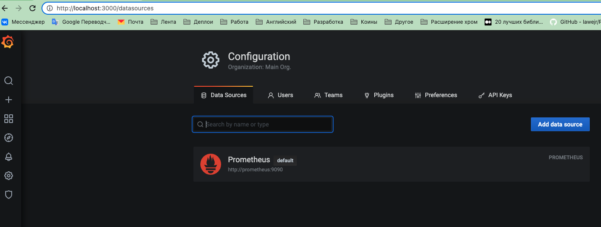
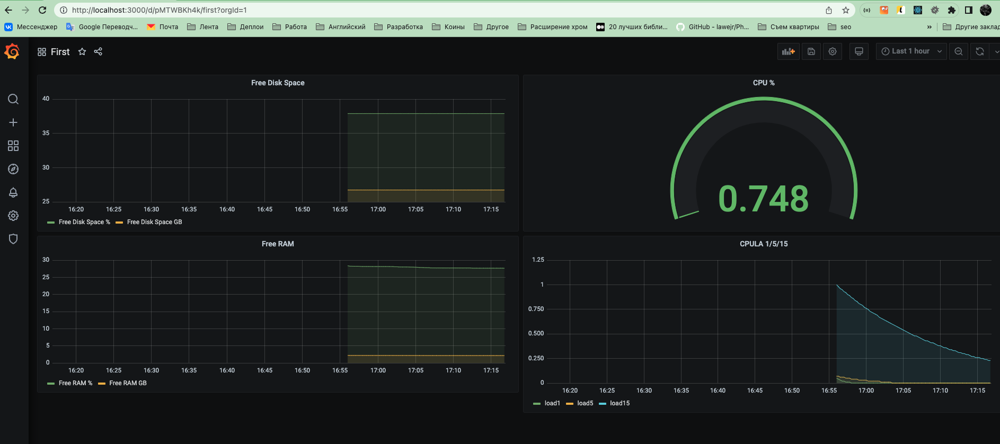
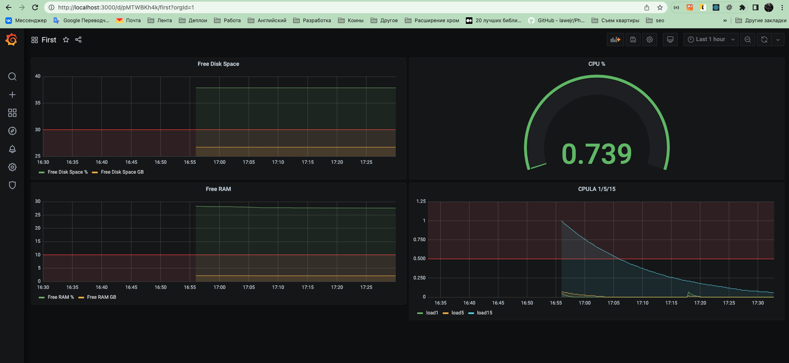

# Домашнее задание к занятию "10.03. Grafana"

## Обязательные задания

### Задание 1
Используя директорию [help](./help) внутри данного домашнего задания - запустите связку prometheus-grafana.

Зайдите в веб-интерфейс графана, используя авторизационные данные, указанные в манифесте docker-compose.

Подключите поднятый вами prometheus как источник данных.

Решение домашнего задания - скриншот веб-интерфейса grafana со списком подключенных Datasource.

### Ответ

## Задание 2
Изучите самостоятельно ресурсы:
- [promql-for-humans](https://timber.io/blog/promql-for-humans/#cpu-usage-by-instance)
- [understanding prometheus cpu metrics](https://www.robustperception.io/understanding-machine-cpu-usage)

Создайте Dashboard и в ней создайте следующие Panels:
- Утилизация CPU для nodeexporter (в процентах, 100-idle)
- > 100 - (avg by (instance) (rate(node_cpu_seconds_total{mode="idle",job="nodeexporter"}[1m])) * 100)
- CPULA 1/5/15
- > node_load1{job="nodeexporter"}
  > 
  > node_load5{job="nodeexporter"}
  > 
  > node_load15{job="nodeexporter"}
- Количество свободной оперативной памяти
- > В процентах:
  > 
  > (node_memory_MemFree_bytes{job="nodeexporter"} / node_memory_MemTotal_bytes{job="nodeexporter"}) * 100
  > 
  > В GB:
  > 
  > node_memory_MemFree_bytes{job="nodeexporter"} / 1024 ^ 3
    
- Количество места на файловой системе
- > В процентах:
  > 
  > (node_filesystem_free_bytes{job="nodeexporter",fstype!~"vfat|tmpfs|ramfs"} / node_filesystem_size_bytes{job="nodeexporter",fstype!~"vfat|tmpfs|ramfs"}) * 100
  > 
  > В GB:
  > 
  > node_filesystem_free_bytes{job="nodeexporter",fstype!~"ramfs|tmpfs|vfat"} / 1024 ^ 3

Для решения данного ДЗ приведите promql запросы для выдачи этих метрик, а также скриншот получившейся Dashboard.

## Задание 3
Создайте для каждой Dashboard подходящее правило alert (можно обратиться к первой лекции в блоке "Мониторинг").

Для решения ДЗ - приведите скриншот вашей итоговой Dashboard.

## Задание 4
Сохраните ваш Dashboard.

Для этого перейдите в настройки Dashboard, выберите в боковом меню "JSON MODEL".

Далее скопируйте отображаемое json-содержимое в отдельный файл и сохраните его.

В решении задания - приведите листинг этого файла.

### Ответ

[dash.json](./dash.json)
