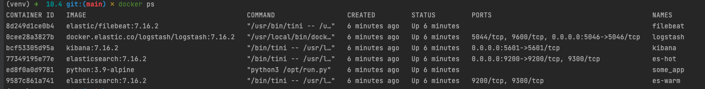
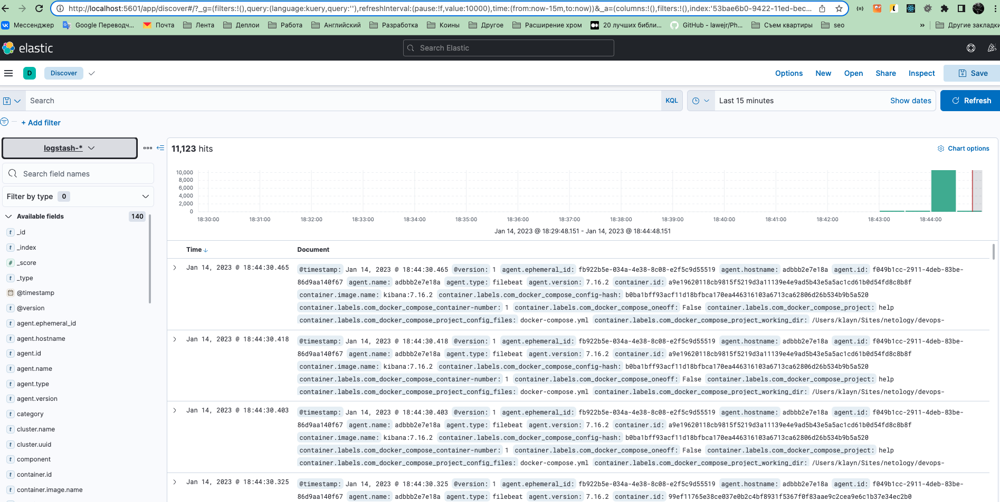

# Домашнее задание к занятию "10.04. ELK"

## Задание 1

Вам необходимо поднять в докере:
- elasticsearch(hot и warm ноды)
- logstash
- kibana
- filebeat

и связать их между собой.

Logstash следует сконфигурировать для приёма по tcp json сообщений.

Filebeat следует сконфигурировать для отправки логов docker вашей системы в logstash.

В директории [help](./help) находится манифест docker-compose и конфигурации filebeat/logstash для быстрого 
выполнения данного задания.

Результатом выполнения данного задания должны быть:
- скриншот `docker ps` через 5 минут после старта всех контейнеров (их должно быть 5)
- скриншот интерфейса kibana

### Ответ

#### скрин docker ps


#### скрин kibana


## Задание 2

Перейдите в меню [создания index-patterns  в kibana](http://localhost:5601/app/management/kibana/indexPatterns/create)
и создайте несколько index-patterns из имеющихся.

Перейдите в меню просмотра логов в kibana (Discover) и самостоятельно изучите как отображаются логи и как производить 
поиск по логам.

В манифесте директории help также приведенно dummy приложение, которое генерирует рандомные события в stdout контейнера.
Данные логи должны порождать индекс logstash-* в elasticsearch. Если данного индекса нет - воспользуйтесь советами 
и источниками из раздела "Дополнительные ссылки" данного ДЗ.
 

### Ответ

Как и было завялено, прочитал доп. материал. 

В итоге исправил наименование индекса в логсташе, иначе была ошибка invalid_index_name_exception. Заменил на 

```yaml
index => "logstash-%{+YYYY.MM.dd}"
```

В input логсташа тоже изменил вместо tpc, на beat 
```json
input {
  beats {
    port => 5046
    codec => json
  }
}
```

Так же по логам `docker logs filebeat` filebeat не мог подконектиться к logstash. 
В docker-compose.yml оказывается не было указано network для filebeat. Указал и все заработало 

```yaml
networks:
  - elastic
```



---

### Как оформить ДЗ?

Выполненное домашнее задание пришлите ссылкой на .md-файл в вашем репозитории.

---

 
