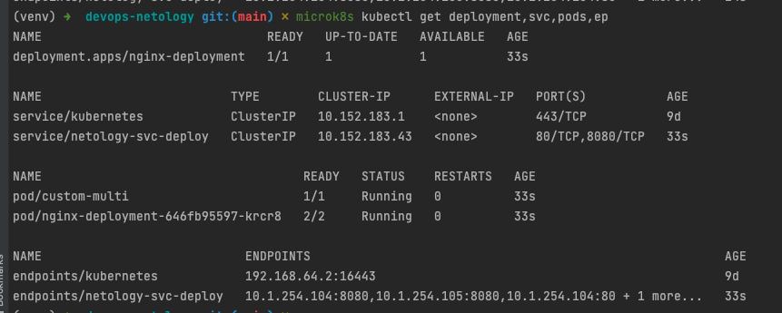
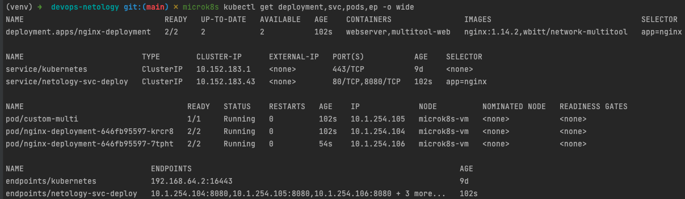
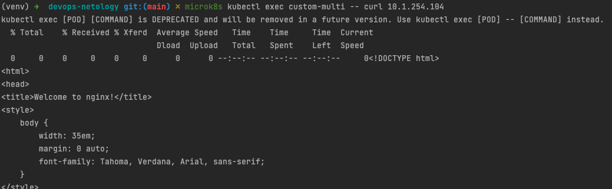
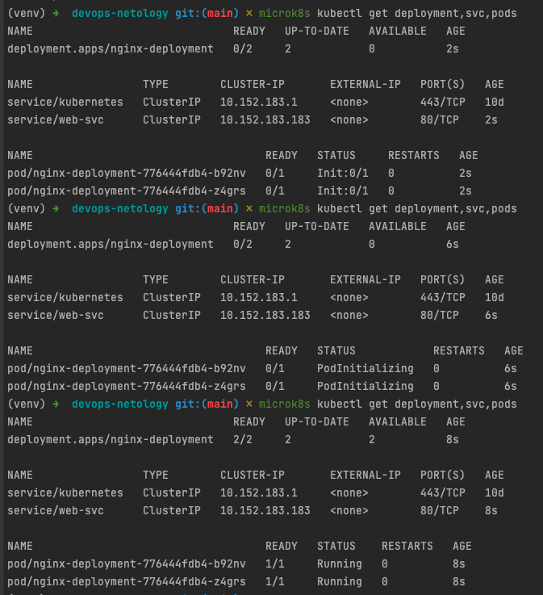

# Домашнее задание к занятию "Запуск приложений в K8S"

### Задание 1. Создать Deployment и обеспечить доступ к репликам приложения из другого Pod'а

1. Создать Deployment приложения состоящего из двух контейнеров - nginx и multitool. Решить возникшую ошибку
2. После запуска увеличить кол-во реплик работающего приложения до 2
3. Продемонстрировать кол-во подов до и после масштабирования
4. Создать Service, который обеспечит доступ до реплик приложений из п.1
5. Создать отдельный Pod с приложением multitool и убедиться с помощью `curl` что из пода есть доступ до приложений из п.1

### Ответ

Была ошибка `Defaulted container "webserver" out of: webserver, multitool-web`

Долго искал проблему. Понял, что мы запускаем несколько экземпляров ngixn в одной ноде, поэтому порты уже заняты.
В multitool можно изменить http и https порты на кастомные. Конфигурация находится [тут](./1-dep.yaml)

Поды деплоя целиком с одной репликой

Поды с двумя репликами

Проверка из кастомного пода до деплоя

------

### Задание 2. Создать Deployment и обеспечить старт основного контейнера при выполнении условий

1. Создать Deployment приложения nginx и обеспечить старт контейнера только после того, как будет запущен сервис этого приложения
2. Убедиться, что nginx не стартует. В качестве init-контейнера взять busybox
3. Создать и запустить Service. Убедиться, что nginx запустился
4. Продемонстрировать состояние пода до и после запуска сервиса

### Ответ

Конфигурация указана [тут](./2-dep.yaml)

Создавал сразу с сервисом. Когда-то слышал от нашего devops, что для проверки нужен сервис обязательно

Состояние объектов после запуска деплоя

