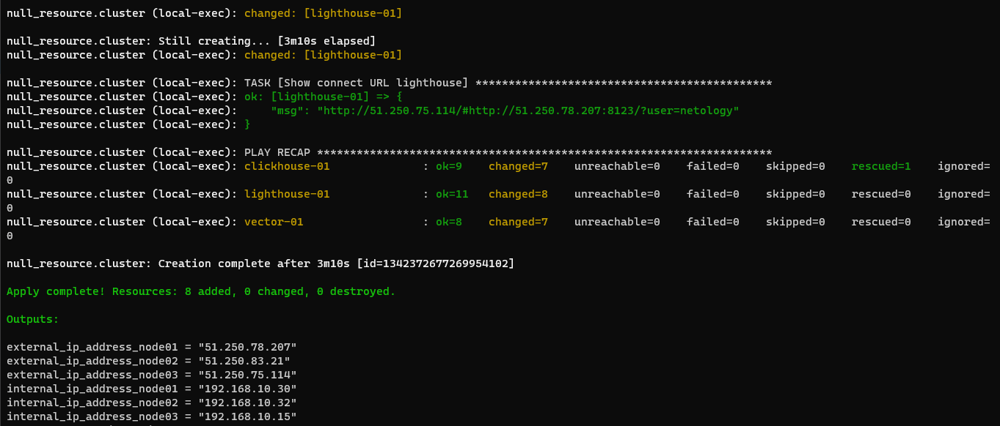
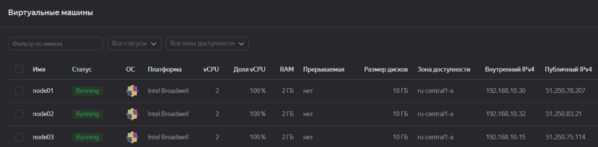
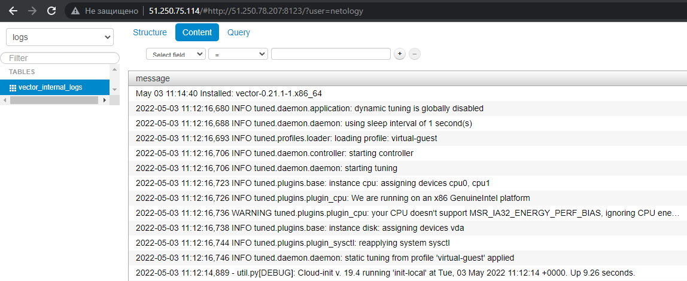

# Задание 08-ansible-03-yandex

## Подготовка к выполнению

1. Подготовьте в Yandex Cloud три хоста: для `clickhouse`, для `vector` и для `lighthouse`.

## Основная часть

1. Допишите playbook: нужно сделать ещё один play, который устанавливает и настраивает lighthouse.
2. При создании tasks рекомендую использовать модули: `get_url`, `template`, `yum`, `apt`.
3. Tasks должны: скачать статику lighthouse, установить nginx или любой другой webserver, настроить его конфиг для открытия lighthouse, запустить webserver.
4. Приготовьте свой собственный inventory файл `prod.yml`.
5. Запустите `ansible-lint site.yml` и исправьте ошибки, если они есть.
6. Попробуйте запустить playbook на этом окружении с флагом `--check`.
7. Запустите playbook на `prod.yml` окружении с флагом `--diff`. Убедитесь, что изменения на системе произведены.
8. Повторно запустите playbook с флагом `--diff` и убедитесь, что playbook идемпотентен.
9. Подготовьте README.md файл по своему playbook. В нём должно быть описано: что делает playbook, какие у него есть параметры и теги.
10. Готовый playbook выложите в свой репозиторий, поставьте тег `08-ansible-03-yandex` на фиксирующий коммит, в ответ предоставьте ссылку на него.

### Ответ

- В плейбук [site.yml](./site.yml) добавлен play, который устанавливает и настраивает lighthouse
- Дописаны [конфигурационные файлы](./templates) для настройки сервисов 
- Созданы необходимые [group_vars](./group_vars)
- Инвентори `prod.yaml` собирает [terraform](./terraform/inventory.tf) в процессе инициализации инфраструктуры
- Запуск плейбука [site.yml](./site.yml) происходит автоматически из [terraform](./terraform/ansible.tf) после деплоя машин и формирования инвентори
- Для того что бы запустить создание и настройку машин необходимо:
  - Получить токен и поместить его в `env`
    ```bash
    export YC_TOKEN=`yc iam create-token`
    ```
  - Перейти в каталог с terraform, запустить `init` и `apply` 
    ```bash
    terraform init
    terraform apply -auto-approve
    ```
      
      
    - В конце будет получена строка для подключения к lighthouse `http://51.250.75.114/#http://51.250.78.207:8123/?user=netology`. 
    Можно выполнить подключение и увидеть записанные данные в БД. Логин/пароль netology/netology
    
  - Для удаления созданных ресурсов запустить
    ```bash
    terraform destroy -auto-approve
    ```